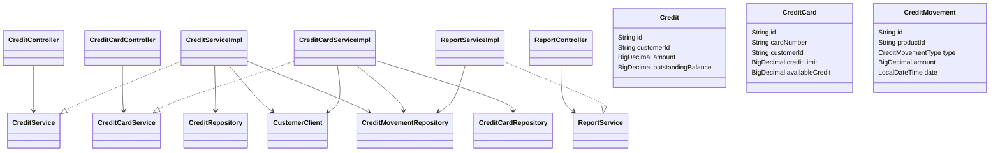
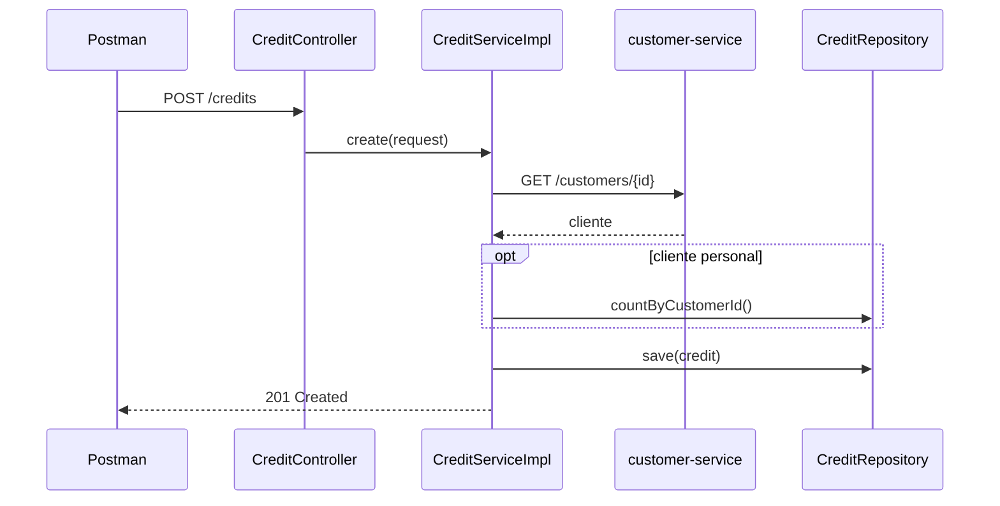
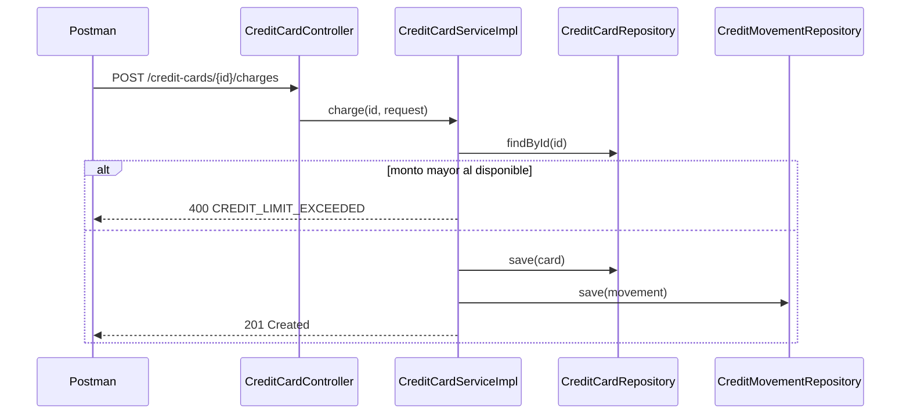
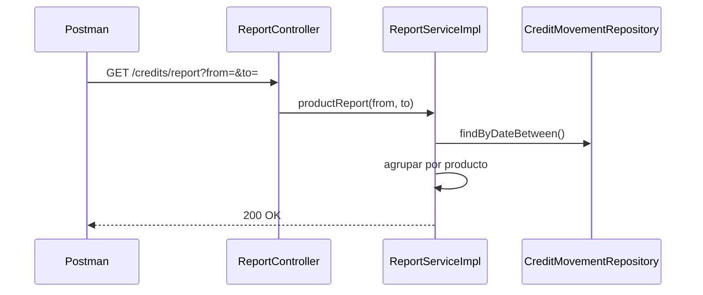

# Diagramas

## Clases

```mermaid
classDiagram
  CreditController --> CreditService
  CreditCardController --> CreditCardService
  CreditServiceImpl ..|> CreditService
  CreditCardServiceImpl ..|> CreditCardService
  CreditServiceImpl --> CreditRepository
  CreditServiceImpl --> CustomerClient
  CreditCardServiceImpl --> CreditCardRepository
  CreditCardServiceImpl --> CustomerClient
  CreditServiceImpl --> CreditMovementRepository
  CreditCardServiceImpl --> CreditMovementRepository
  ReportController --> ReportService
  ReportServiceImpl ..|> ReportService
  ReportServiceImpl --> CreditMovementRepository
  class Credit {
    String id
    String customerId
    BigDecimal amount
    BigDecimal outstandingBalance
  }
  class CreditCard {
    String id
    String cardNumber
    String customerId
    BigDecimal creditLimit
    BigDecimal availableCredit
  }
  class CreditMovement {
    String id
    String productId
    CreditMovementType type
    BigDecimal amount
    LocalDateTime date
  }
```

## Secuencia: crear crédito

```mermaid
sequenceDiagram
  Postman->>CreditController: POST /credits
  CreditController->>CreditServiceImpl: create(request)
  CreditServiceImpl->>customer-service: GET /customers/{id}
  customer-service-->>CreditServiceImpl: cliente
  opt cliente personal
    CreditServiceImpl->>CreditRepository: countByCustomerId()
  end
  CreditServiceImpl->>CreditRepository: save(credit)
  CreditServiceImpl-->>Postman: 201 Created
```

## Secuencia: consumo con tarjeta

```mermaid
sequenceDiagram
  Postman->>CreditCardController: POST /credit-cards/{id}/charges
  CreditCardController->>CreditCardServiceImpl: charge(id, request)
  CreditCardServiceImpl->>CreditCardRepository: findById(id)
  alt monto mayor al disponible
    CreditCardServiceImpl-->>Postman: 400 CREDIT_LIMIT_EXCEEDED
  else
    CreditCardServiceImpl->>CreditCardRepository: save(card)
    CreditCardServiceImpl->>CreditMovementRepository: save(movement)
    CreditCardServiceImpl-->>Postman: 201 Created
  end
```

## Secuencia: reporte por producto

```mermaid
sequenceDiagram
  Postman->>ReportController: GET /credits/report?from=&to=
  ReportController->>ReportServiceImpl: productReport(from, to)
  ReportServiceImpl->>CreditMovementRepository: findByDateBetween()
  ReportServiceImpl->>ReportServiceImpl: agrupar por producto
  ReportServiceImpl-->>Postman: 200 OK
```
